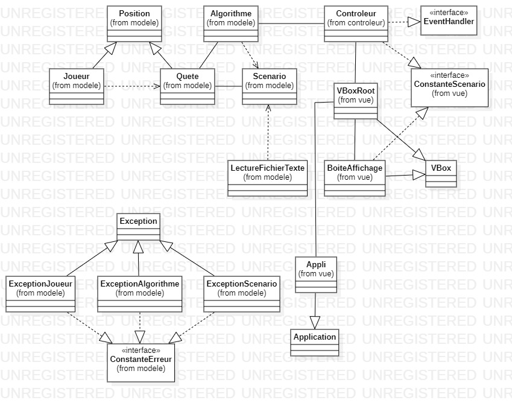
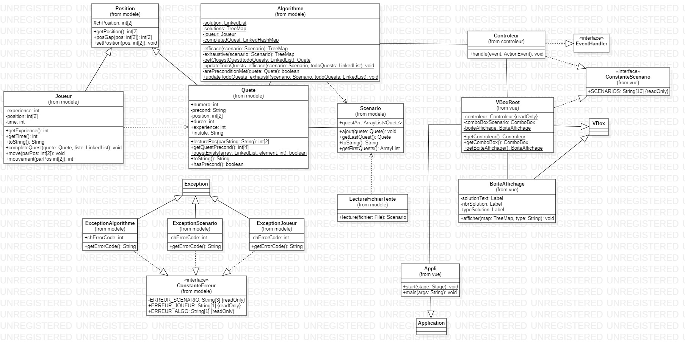

# <center> SAÉ 2.01 et 2.02 </center>

## Introduction
Lors de la SAÉ 2.01 Exploration Algorithmique il nous a été demandé de réaliser un programme
qui propose une/des solutions efficace, la plus longue (exhaustive), la plus rapide (speedrun). Puis
lors de la SAÉ 2.02 de réaliser l'IHM tout en respectant l'architecture MVC.

### <u>Le modèle : </u>
Notre programme propose une solution `exhautive` et `efficace`, la solution exhautive
propose le comportement d'un joueur qui complète le scénario à 100% tandis que la solution
efficace propose une solution d'un joueur qui complète le scénario en se déplacant uniquement
vers les quêtes les plus proches.
### <u>La vue et le controleur : </u>
Notre application affiche le chemin que le joueur a emprunté pour arriver aux solutions
sélectionnées avec le nombre de solution en appuyant sur les boutons `exhautive` ou `efficace` et le temps qu'a mis
le joueur pour finir le scénario sélectionné. Il est également possible de cliquer sur le bouton
`En savoir plus...` qui permet d'avoir des informaitons sur le scénario sélectionné (Premières quêtes, dernière quête ainsi que le nombre
de quêtes qui composent le scénario).

## La qualité de développement
Nous avons choisi de réaliser ce projet avec un cycle en V, c'est à dire :

* Conception
* Test
* Programmation
* Documentation

pour respecter ce cycle de vie, nous nous sommes réparti les tâches de manière équitable pour chaque étape
sauf la documentation et la partie IHM qui ont été effectuées sur le même poste à l'IUT. Le projet a été réalisé avec l'aide de git, sur un repository sur GitHub 
et les tests unitaire ont été évidemment effectués sur Junit.

Nous avons respecté le cycle en V comme cela était convenu dans le WBS.

## La conception générale
* Le diagramme de classes de haut niveau :
  
  

* Le diagramme des classes détaillé pour chaque composant : modèle, vue et contrôleur :
  

Comme précisé précédemment nous avons réalisé la méthode `exhaustif` et `efficace` pour ce faire nous avons la même structure de code, c'est à dire que lors de l'exécution du programme le joueur cherchera tout le temps à aller à la quête la plus proche si il remplit les conditions.

### <u>Présentation des structures de données :</u>
Pour pouvoir lire les fichier texte à la racine du projet dans le dossier `txt/` la classe `LectureFichierTexte` possède une methode statique `lecture()`
```java
public static Scenario lecture(File fichier) 
{
    Scenario scenario = new Scenario();
    try 
    {
        Scanner scanner = new Scanner(fichier);
        while (scanner.hasNext()) 
        {
            scenario.ajout(new Quete(scanner.nextLine()));
        }
    } 
    catch (FileNotFoundException e) {
        System.err.println(e.getMessage());
    }
    return scenario;
}
```
cette méthode aura pour effet de construire un objet `Scenario` qui est une liste de `Quete`. Sachant qu'une quête se compose d'un numéro, précondition, durée, experience, intitule et une `Position`. La classe `Position` est mère de `Joueur` et `Quete`, elle définit ce qu'est une Position c'est à dire la position d'un élément x et y dans le `Scenario` ainsi qu'une méthode permettant le calcul de l'écart entre deux positions :
```java
public int[] posGap(int[] pos) 
{
    int[] ecartPositions = new int[2];
    ecartPositions[0] = Math.abs(this.getPosition()[0] - pos[0]);
    ecartPositions[1] = Math.abs(this.getPosition()[1] - pos[1]);
    return ecartPositions;
}
```
Cette permet le calcul de chemin `efficace` et `èxhaustif` dans la classe `Algorithme`.

### <u> Vérification des préconditions :</u>

La vérification des conditions est en grande partie vérifiée par ce boolean :
```java
boolean preconditionsMet = Quete.questExists(solution, preconditions[0]) || Quete.questExists(solution, preconditions[1]) && ((preconditions[2] == 0 && preconditions[3] == 0) || Quete.questExists(solution, preconditions[2]) || Quete.questExists(solution, preconditions[3]));
```
malgrès sa longueur il est très efficace car il permet de vérifier chaque précondition d'une quête stockée dans un tableau de 4 entier, on vérifie les préconditions sous cette forme : 

Soit un tableau de préconditions [1, 2, 3, 4]

le tableau sera interpreté comme ceci (1 OU 2) ET (3 OU 4)

alors si le joueur a effectué la quête numéro 1 ou 2 et la quête 3 ou 4 il pourra faire la quête ci-dessus.

Le programme vérifie aussi si le joueur possède l'experience nécessaire pour faire la quête 0 :
```java
private static boolean arePreconditionsMet(Quete quete)
{
    int[] preconditions = quete.getQuestPrecond();
    boolean preconditionsMet = Quete.questExists(solution, preconditions[0]) || Quete.questExists(solution, preconditions[1]) && ((preconditions[2] == 0 && preconditions[3] == 0) || Quete.questExists(solution, preconditions[2]) || Quete.questExists(solution, preconditions[3]));
    if (quete.numero == 0)
    {
        return preconditionsMet && joueur.getExperience() >= quete.experience;
    }
    else
    {
        return preconditionsMet;
    }
}
```

### <u>Le comportement du joueur : </u>
Le Joueur ira tout le temps à la quête la plus proche grâce à cette méthode :
```java
private static Quete getClosestQuest(LinkedList<Quete> todoQuests)
    {
        Quete closestQuest = null;
        int closestDistance = 0;
        int counter = 0;

        for (Quete quete : todoQuests)
        {
            int time = joueur.mouvement(quete.getPosition()) + quete.duree;

            if (time < closestDistance || counter == 0)
            {
                closestQuest = quete;
                closestDistance = time;
            }
            counter+=1;
        }
        return closestQuest;
    }
```
Dans cette méthode on parcourt toutes les quêtes que compte faire notre joueur (`todoQuests`) grâce à un foreach et on compare chaque quête avec le mouvement que devra effectuer le joueur pour y arriver, de par cette méthode la quête la moins distante sera toujours choisie par le joueur.

### <u>L'actualisation des quête à réaliser :</u>
Pour actualiser la liste `todoQuests` une méthode par type de solution (efficace et exhaustive) a été réalisé car le résultat final n'est pas le même dans ces deux cas, il existe donc deux méthodes :
* `updateTodoQuests_efficace`
* `updateTodoQuests_exhaustif`

dans le cas de la méthode `updateTodoQuests_efficace` :
```java
private static void updateTodoQuests_efficace(Scenario scenario, LinkedList<Quete> todoQuests) throws ExceptionScenario
{
    todoQuests.clear(); //vide la liste
    for (Quete quete : scenario.questArr)
    {
        if (!completedQuest.get(quete) && arePreconditionsMet(quete))
        {
            todoQuests.add(quete);
        }
    }
}
```
il s'agit juste de vider la liste des quêtes à réaliser pour éviter les doublons puis d'y ajouter les quêtes qui n'ont pas été complétées tout en vérifiant si les conditions sont bien remplies pour remplir cette quête

Et dans le cas de la méthode `updateTodoQuests_exhaustif` :
```java
private static void updateTodoQuests_exhaustif(Scenario scenario, LinkedList<Quete> todoQuests) throws ExceptionScenario 
{
    todoQuests.clear(); //vide la liste
    for (Quete quete : scenario.questArr)
    {
        if (!completedQuest.get(quete) && arePreconditionsMet(quete) && quete != scenario.getLastQuest())
        {
            todoQuests.add(quete);
        }
    }
}
```
c'est sensiblement la même chose sauf que je n'ajoute jamais la dernière quête à ma liste des quêtes à réaliser car je la complète uniquement quand toutes les quêtes sont réalisées dans la méthode `exhaustif`

### <u>L'éxecution de ces méthodes dans le programme :</u>
L'exécution de ces méthodes dans le programme est la suivante dans le cas de la méthode exhaustif par exemple:
```java
Quete nextQuest = getClosestQuest(todoQuests);
joueur.move(nextQuest.getPosition());
joueur.completeQuest(nextQuest, solution);
completedQuest.put(nextQuest, true);
updateTodoQuests_exhaustif(scenario, todoQuests);
```
ce bout de code est exécuté dans une boucle while pour s'assurer d'avoir bien fait toutes les quêtes nécessaires.

## Conclusion

Pour conclure dans ces SAÉ2.01 et SAÉ2.02 le niveau 1 a été réalisé en proposant deux méthodes `efficace` et `exhaustif` qui dépendent de plusieurs classes : 
* `Quete` 
* `Joueur` 
* `LectureFichierTexte` 
* `Position` 
* `Scenario` 

et qui permettent le calcul de deux solutions réfléchies de manière éfficace.

Les niveaux 2 et 3 n'ont pas été fait mais avec des algorithmes récursifs il aurait été plus simple de proposer plusieurs solutions, il aurait aussi été plus simple de déterminer le chemin le plus rapide (speedrun) en comparant chaque solutions entre elles.

## Annexe

Voici le repo git contenant le programme, la javadoc ainsi que les dossiers de test :
[Lien vers le GitHub](https://github.com/Guamss/SAE_2.02/ "Github").